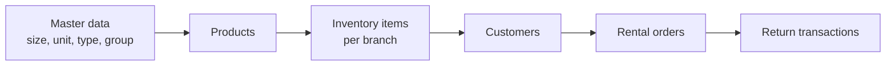

# FE Integration Guide — RENTA Backend API

> Tài liệu này dành cho team Frontend (và Claude.ai trên FE). Mô tả **cần build module gì**, **tính năng nào**, và **cách tích hợp API**.
>
> **Swagger (source of truth chi tiết)**: `http://localhost:3000/api/docs`  
> **Base URL mặc định**: `http://localhost:3000/api`

---

## 1. Tổng quan hệ thống

RENTA là nền tảng **multi-tenant** cho thuê đồ. Backend chia thành **2 ứng dụng FE** chính:

| FE App                | Đối tượng dùng              | Auth endpoint      | Mục đích                                         |
| --------------------- | --------------------------- | ------------------ | ------------------------------------------------ |
| **SaaS Admin Portal** | Nhân viên vận hành nền tảng | `POST /auth/login` | Quản lý tenant, chi nhánh, user                  |
| **Tenant Portal**     | Nhân viên cửa hàng/thuê     | `POST /auth/login` | Vận hành thuê: sản phẩm, kho, đơn thuê, trả hàng |

> **Một auth chung**: cả hai portal login qua **cùng** `POST /auth/login` (username + password, username unique toàn cục). Token trả về mang `userType` (`SAAS_ADMIN` | `TENANT`), `isAdmin`, và `tenantId` (chỉ với tenant user) — FE dựa vào đó để định tuyến/phân quyền.

```
┌─────────────────────┐         ┌─────────────────────┐
│   SaaS Admin FE     │         │    Tenant FE        │
│  (platform ops)     │         │  (shop operations)  │
└─────────┬───────────┘         └─────────┬───────────┘
          │                               │
          └───────────┬───────────────────┘
                      ▼
                   /auth/*           (login chung, phân biệt bằng userType)
   /tenants, /branches, /users   /products, /rental-orders, ...
                      │
                      ▼
              renta-be /api
```

---

## 2. Quy ước tích hợp API

### 2.1 Response envelope

Mọi response thành công được bọc bởi `TransformInterceptor`:

```json
{
  "success": true,
  "data": {
    /* payload thực tế */
  },
  "timestamp": "2026-06-09T10:00:00.000Z"
}
```

Lỗi (`AllExceptionsFilter`):

```json
{
  "success": false,
  "error": {
    "code": "SIZE_NAME_ALREADY_EXISTS",
    "message": "Size \"M\" already exists for this tenant"
  },
  "path": "/api/sizes",
  "timestamp": "2026-06-09T10:00:00.000Z"
}
```

- Hiển thị lỗi cho user: dùng `error.message`
- Logic phân nhánh (i18n, retry…): dùng `error.code` (machine-readable)
- HTTP status vẫn là status code thực (400, 404, 409…)

### 2.2 Pagination (list endpoints)

Query params chung:

| Param      | Default | Mô tả                                            |
| ---------- | ------- | ------------------------------------------------ |
| `page`     | `1`     | Trang hiện tại                                   |
| `pageSize` | `20`    | Số item/trang                                    |
| `order`    | `DESC`  | `ASC` hoặc `DESC`                                |
| `search`   | —       | Tìm kiếm (accent-insensitive, tùy resource)      |
| `tenantId` | —       | Lọc theo tenant (hầu hết resource tenant-scoped) |

Response list (bên trong `data`):

```json
{
  "items": [
    /* ... */
  ],
  "total": 100,
  "page": 1,
  "pageSize": 20,
  "totalPages": 5
}
```

### 2.3 IDs & tenant scoping

- **Mọi ID là `string`** (DB dùng `bigint`, API expose dạng string)
- Resource thuộc tenant **bắt buộc truyền `tenantId`** trong body (create) hoặc query (list)
- FE Tenant App cần lưu **context session**:
  - `tenantId` — từ login hoặc cấu hình tenant
  - `branchId` — chi nhánh đang làm việc (từ user-branch assignment)
  - `userId` — user đang đăng nhập (dùng cho `createdBy` trên đơn thuê/trả)

### 2.4 Authentication

#### Login (chung cho cả admin và tenant user)

```http
POST /api/auth/login
Content-Type: application/json

{ "username": "admin", "password": "secret" }
```

> Username **unique toàn cục** nên không cần `tenantId` khi login — BE tự resolve `userType`/`tenantId` từ user row và nhúng vào token.

#### Token response (`data`)

```json
{
  "accessToken": "eyJ...",
  "refreshToken": "eyJ...",
  "tokenType": "Bearer",
  "expiresIn": "15m"
}
```

#### Lấy thông tin user hiện tại (sau login)

Ngay sau khi login, FE nên gọi `GET /auth/me` (kèm Bearer) để lấy profile + thông tin phân quyền của user đang đăng nhập — dùng để định tuyến portal và gate UI.

```http
GET /api/auth/me
Authorization: Bearer <accessToken>
```

Response (`data`):

```json
{
  "id": "1",
  "username": "admin",
  "fullName": "Administrator",
  "phone": null,
  "status": "ACTIVE",
  "userType": "SAAS_ADMIN",
  "tenantId": null,
  "isAdmin": true,
  "permissions": []
}
```

> `permissions` hiện luôn là mảng rỗng (chỗ dành sẵn cho RBAC sau này). FE phân quyền dựa trên `userType` + `isAdmin`; với tenant user, `tenantId` là tenant đang đăng nhập.

#### Refresh token

```http
POST /api/auth/refresh
{ "refreshToken": "..." }
```

#### Gửi request có auth

```http
Authorization: Bearer <accessToken>
```

JWT payload (decode phía FE nếu cần):

| Claim      | SaaS admin   | Tenant user |
| ---------- | ------------ | ----------- |
| `sub`      | user id      | user id     |
| `userType` | `SAAS_ADMIN` | `TENANT`    |
| `username` | ✓            | ✓           |
| `isAdmin`  | ✓ (bool)     | ✓ (bool)    |
| `tenantId` | —            | ✓           |

#### Auth endpoints khác

| Method | Path                    | Auth required | Mô tả                                        |
| ------ | ----------------------- | ------------- | -------------------------------------------- |
| GET    | `/auth/me`              | Bearer        | Profile + phân quyền của user đang đăng nhập |
| POST   | `/auth/change-password` | Bearer        | Đổi mật khẩu (user đang đăng nhập)           |
| POST   | `/auth/forgot-password` | —             | Lấy reset token (`{ username }`)             |
| POST   | `/auth/reset-password`  | —             | Reset bằng token                             |

> **Lưu ý hiện tại**: JWT guard mới áp dụng trên `/auth/me` và `change-password`. Các endpoint CRUD **chưa bắt buộc Bearer** — FE vẫn nên implement full auth flow (login, refresh, attach header) để sẵn sàng khi BE bật guard toàn cục.

### 2.5 HTTP status conventions

| Status | Ý nghĩa                                        |
| ------ | ---------------------------------------------- |
| `200`  | Success (GET, PATCH, PUT)                      |
| `204`  | Success, no body (DELETE, change-password)     |
| `400`  | Validation / bad request                       |
| `404`  | Not found                                      |
| `409`  | Conflict (trùng tên, trạng thái không hợp lệ…) |

### 2.6 Validation

- Request body được validate bởi `class-validator`
- Field không khai báo trong DTO sẽ bị reject (`forbidNonWhitelisted: true`)
- Date gửi dạng **ISO 8601 string**: `"2026-06-09T10:00:00.000Z"`

---

## 3. FE modules cần build

### 3.1 Shared / Core (cả 2 app)

| Module FE     | Mô tả                                                         |
| ------------- | ------------------------------------------------------------- |
| `api-client`  | Axios/fetch wrapper: base URL, envelope unwrap, error handler |
| `auth`        | Login, refresh, token storage, attach Bearer, logout          |
| `pagination`  | Table/list hook: page, pageSize, order, search                |
| `toast/alert` | Hiển thị `error.message`                                      |
| `types`       | TypeScript interfaces mirror response DTOs                    |

**Gợi ý unwrap response:**

```typescript
// data layer
const res = await api.get('/sizes', { params: { tenantId, page: 1 } });
return res.data.data; // { items, total, page, pageSize, totalPages }
```

---

### 3.2 SaaS Admin Portal — modules

| Module FE  | BE resource                  | Màn hình / tính năng                                                                     |
| ---------- | ---------------------------- | ---------------------------------------------------------------------------------------- |
| `auth`     | `auth`                       | Login, forgot/reset password, đổi MK                                                     |
| `tenants`  | `tenants`, `admin/tenants`   | CRUD tenant, activate/deactivate                                                         |
| `branches` | `branches`, `admin/branches` | CRUD chi nhánh theo tenant, set main branch, activate/deactivate                         |
| `users`    | `users`, `admin/users`       | CRUD **mọi** user (SAAS_ADMIN & TENANT) — phân biệt bằng `userType`/`tenantId`/`isAdmin` |
| `packages` | `packages`, `admin/packages` | CRUD gói cước (plan): giới hạn + `features` JSON, activate/deactivate; gán cho tenant    |

**Luồng onboarding tenant mới (Admin):**

1. Tạo tenant → `POST /tenants`
2. Gán gói cước → `PATCH /admin/tenants/:id/package` `{ packageId }` (gói phải ACTIVE)
3. Tạo chi nhánh chính → `POST /branches` (+ `PATCH /admin/branches/:id/main` nếu cần)
4. Tạo tenant user → `POST /users` với `userType: "TENANT"` + `tenantId`

> **Feature gating**: mỗi package bật/tắt các `features` (`multiBranch`, `reports`, `qrCode`, `overdueReminder`, `advancedReports`, `prioritySupport`). BE chặn route theo gói của tenant (`403 FEATURE_NOT_AVAILABLE`); FE nên ẩn/disable UI theo feature của tenant. SAAS_ADMIN không bị giới hạn theo gói.

---

### 3.3 Tenant Portal — modules

Chia theo **domain nghiệp vụ**:

#### A. Auth & context

| Module FE        | BE                                           | Ghi chú                                                  |
| ---------------- | -------------------------------------------- | -------------------------------------------------------- |
| `auth`           | `auth`                                       | Login chung (username + password); token mang `tenantId` |
| `branch-context` | `tenant-users/:userId/branches`              | Chọn chi nhánh làm việc, set default                     |
| `users`          | `users` (filter `userType=TENANT&tenantId=`) | Quản lý nhân viên tenant (admin role)                    |

#### B. Master data (danh mục)

Thiết lập **trước** khi tạo sản phẩm. Pattern CRUD giống nhau:

| Module FE        | Route             | Status            |
| ---------------- | ----------------- | ----------------- |
| `sizes`          | `/sizes`          | ACTIVE / INACTIVE |
| `units`          | `/units`          | ACTIVE / INACTIVE |
| `product-types`  | `/product-types`  | ACTIVE / INACTIVE |
| `product-groups` | `/product-groups` | ACTIVE / INACTIVE |

Mỗi module: list (paginated + filter `tenantId`, `status`, `search`), create, edit, delete, toggle status (`PATCH :id/status`).

#### C. Catalog & inventory

| Module FE         | Route              | Mô tả                                                           |
| ----------------- | ------------------ | --------------------------------------------------------------- |
| `products`        | `/products`        | Sản phẩm cho thuê (giá, ảnh, sizeIds, liên kết type/group/unit) |
| `inventory-items` | `/inventory-items` | **Từng món vật lý** tại chi nhánh (serial, barcode, trạng thái) |

**Product** — fields quan trọng:

- `productTypeId`, `productGroupId`, `unitId` — FK tới master data
- `code` — unique per tenant
- `rentalPrice`, `depositPrice`
- `sizeIds[]` — các size áp dụng
- `images[]` — `{ url, sortOrder, isPrimary }`

**Inventory item** — fields quan trọng:

- `branchId`, `productId`, `sizeId`
- `serialCode`, `barcode`
- `status`: lifecycle (AVAILABLE, RENTED, MAINTENANCE, LOST, DISABLED)
- `conditionStatus`: tình trạng vật lý (NEW, GOOD, FAIR, NEEDS_CLEANING, NEEDS_REPAIR, DAMAGED)

List filter thêm: `branchId`, `productId`, `sizeId`, `status`, `conditionStatus`.

#### D. Customers

| Module FE   | Route        | Mô tả                                  |
| ----------- | ------------ | -------------------------------------- |
| `customers` | `/customers` | CRUD khách hàng (name, phone, address) |

- `phone` dùng để dedupe khi tạo đơn thuê inline customer
- Filter list: `tenantId`, `branchId`, `search` (name/phone)

#### E. Rental operations (core business)

| Module FE             | Route                  | Mô tả                         |
| --------------------- | ---------------------- | ----------------------------- |
| `rental-orders`       | `/rental-orders`       | Tạo/sửa/xác nhận/hủy đơn thuê |
| `return-transactions` | `/return-transactions` | Trả hàng (full hoặc partial)  |

---

## 4. Business flows — Tenant Portal

### 4.1 Setup flow (lần đầu)



### 4.2 Rental order lifecycle

**Order status (`RentalOrderStatus`):**

| Status               | Ý nghĩa FE                                   |
| -------------------- | -------------------------------------------- |
| `DRAFT`              | Nháp — chưa giữ hàng, có thể sửa/xóa         |
| `RENTING`            | Đang cho thuê — inventory đã RESERVED/RENTED |
| `PARTIALLY_RETURNED` | Trả một phần                                 |
| `RETURNED`           | Trả hết                                      |
| `OVERDUE`            | Quá hạn (BE set)                             |
| `CANCELLED`          | Đã hủy — inventory được release              |

**Tạo đơn** — `POST /rental-orders`:

```json
{
  "tenantId": "1",
  "branchId": "2",
  "orderCode": "RO-2026-001",
  "createdBy": "10",
  "customerId": "5",
  "rentDate": "2026-06-09T08:00:00.000Z",
  "expectedReturnDate": "2026-06-12T08:00:00.000Z",
  "depositAmount": 500000,
  "discountAmount": 0,
  "note": "",
  "status": "DRAFT",
  "items": [{ "inventoryItemId": "100", "price": 150000 }]
}
```

**Customer**: chọn **một trong hai** (không gửi cả hai):

- `customerId` — khách có sẵn
- `customer` — `{ name, phone, address?, note? }` — BE tự reuse nếu trùng phone

**Initial status**:

- `DRAFT` — lưu nháp, **không** đổi inventory
- `RENTING` (default nếu bỏ qua) — **giữ inventory ngay** (AVAILABLE → RENTED)

**Các action sau tạo:**

| Action   | API                                | Điều kiện                                                 |
| -------- | ---------------------------------- | --------------------------------------------------------- |
| Sửa đơn  | `PUT /rental-orders/:id`           | Chỉ `DRAFT` (note, deposit, discount, expectedReturnDate) |
| Xác nhận | `PATCH /rental-orders/:id/confirm` | `DRAFT` → `RENTING`, reserve inventory                    |
| Hủy      | `PATCH /rental-orders/:id/cancel`  | Release inventory đã giữ                                  |
| Xóa      | `DELETE /rental-orders/:id`        | Chỉ `DRAFT` hoặc `CANCELLED`                              |

**Màn hình FE gợi ý cho Rental Orders:**

1. **List** — filter: tenantId, branchId, customerId, status, search (orderCode)
2. **Create wizard** — chọn khách (existing/new) → chọn inventory AVAILABLE → nhập ngày/giá
3. **Detail** — hiển thị items, fees, status badge, actions theo status
4. **Confirm/Cancel** — confirm dialog

### 4.3 Return flow

**Tạo phiên trả** — `POST /return-transactions`:

```json
{
  "tenantId": "1",
  "branchId": "2",
  "rentalOrderId": "50",
  "createdBy": "10",
  "returnDate": "2026-06-12T10:00:00.000Z",
  "lateFee": 50000,
  "note": "",
  "items": [
    {
      "rentalOrderItemId": "200",
      "inventoryItemId": "100",
      "conditionStatus": "GOOD",
      "damageFee": 0,
      "note": ""
    }
  ]
}
```

- Hỗ trợ **trả một phần** — chỉ gửi subset items
- `conditionStatus` bắt buộc — ảnh hưởng inventory condition sau trả
- BE cập nhật order status → `PARTIALLY_RETURNED` hoặc `RETURNED`

**Màn hình FE:**

1. Từ order detail → nút "Trả hàng"
2. Chọn items chưa RETURNED, nhập condition + damage fee
3. Xem lịch sử trả: `GET /return-transactions?rentalOrderId=...`

---

## 5. API reference — tất cả endpoints

> Prefix: `/api`. Chi tiết request/response field xem Swagger.

### 5.1 Auth

| Method | Path                    | Body chính                                                           |
| ------ | ----------------------- | -------------------------------------------------------------------- |
| POST   | `/auth/login`           | `{ username, password }`                                             |
| GET    | `/auth/me`              | — (Bearer) → profile + `userType`/`isAdmin`/`tenantId`/`permissions` |
| POST   | `/auth/refresh`         | `{ refreshToken }`                                                   |
| POST   | `/auth/change-password` | `{ currentPassword, newPassword }` (Bearer)                          |
| POST   | `/auth/forgot-password` | `{ username }`                                                       |
| POST   | `/auth/reset-password`  | `{ token, newPassword }`                                             |

### 5.2 SaaS Admin — Tenants

| Method | Path                         | Ghi chú                                                                          |
| ------ | ---------------------------- | -------------------------------------------------------------------------------- |
| POST   | `/tenants`                   | Create                                                                           |
| GET    | `/tenants`                   | List (paginated)                                                                 |
| GET    | `/tenants/:id`               | Detail                                                                           |
| PUT    | `/tenants/:id`               | Update                                                                           |
| PATCH  | `/admin/tenants/:id/status`  | `{ status: ACTIVE \| INACTIVE }`                                                 |
| PATCH  | `/admin/tenants/:id/package` | `{ packageId }` — gán gói (null để gỡ); gói phải ACTIVE. Response có `packageId` |

### 5.3 SaaS Admin — Branches

| Method | Path                         | Ghi chú                                      |
| ------ | ---------------------------- | -------------------------------------------- |
| POST   | `/branches`                  | Create (cần `tenantId`)                      |
| GET    | `/branches`                  | List — filter `tenantId`, `status`, `search` |
| GET    | `/branches/:id`              | Detail                                       |
| PUT    | `/branches/:id`              | Update                                       |
| PATCH  | `/admin/branches/:id/status` | Activate/deactivate                          |
| PATCH  | `/admin/branches/:id/main`   | Set làm chi nhánh chính                      |

### 5.4 Users (chung — SAAS_ADMIN & TENANT)

| Method | Path                      | Ghi chú                                                                                                       |
| ------ | ------------------------- | ------------------------------------------------------------------------------------------------------------- |
| POST   | `/users`                  | Create — body cần `userType` (`SAAS_ADMIN` \| `TENANT`); `tenantId` bắt buộc khi `TENANT`; `isAdmin` optional |
| GET    | `/users`                  | List — filter `userType`, `tenantId`, `status`, `search`                                                      |
| GET    | `/users/:id`              | Detail (trả `userType`, `tenantId`, `isAdmin`)                                                                |
| PUT    | `/users/:id`              | Update                                                                                                        |
| DELETE | `/users/:id`              | Delete                                                                                                        |
| PATCH  | `/admin/users/:id/status` | Activate/deactivate                                                                                           |

### 5.4b SaaS Admin — Packages (plans)

| Method | Path                         | Ghi chú                                                                                                          |
| ------ | ---------------------------- | ---------------------------------------------------------------------------------------------------------------- |
| POST   | `/packages`                  | Create — `code` (unique), `name`, `priceMonthly/Yearly`, `maxBranches/Users/Products/InventoryItems`, `features` |
| GET    | `/packages`                  | List — filter `status`, `search`                                                                                 |
| GET    | `/packages/:id`              | Detail                                                                                                           |
| PUT    | `/packages/:id`              | Update (không đổi `code`/`status` ở đây)                                                                         |
| DELETE | `/packages/:id`              | Delete — chặn nếu đang gán cho tenant (`409 PACKAGE_IN_USE`)                                                     |
| PATCH  | `/admin/packages/:id/status` | `{ status: ACTIVE \| INACTIVE }`                                                                                 |

`features` shape: `{ multiBranch?, reports?, qrCode?, overdueReminder?, advancedReports?, prioritySupport? }` (boolean; key lạ bị từ chối). Gán gói cho tenant: `PATCH /admin/tenants/:id/package` (mục 5.2).

### 5.4c Billing — Subscriptions & Invoices

Vòng đời: tenant mới (`POST /tenants` kèm `packageId`) nhận **subscription TRIAL**. Mua/nâng cấp/gia hạn → tạo subscription `PENDING_PAYMENT` + invoice `PENDING`. Thanh toán **thủ công bank transfer**: tenant gửi proof, SaaS Admin duyệt và mark PAID → subscription tự động `ACTIVE`/gia hạn. Hết hạn → `EXPIRED`, chặn truy cập theo gói.

| Method | Path                          | Ghi chú                                                                                                |
| ------ | ----------------------------- | ------------------------------------------------------------------------------------------------------ |
| POST   | `/subscriptions/purchase`     | `{ tenantId, packageId, paymentCycle: MONTHLY\|YEARLY, autoRenew? }` → trả `{ subscription, invoice }` |
| GET    | `/subscriptions`              | List — filter `tenantId`, `status` (`TRIAL/PENDING_PAYMENT/ACTIVE/EXPIRED/CANCELLED`)                  |
| GET    | `/subscriptions/:id`          | Detail                                                                                                 |
| PATCH  | `/subscriptions/:id/cancel`   | Huỷ subscription                                                                                       |
| GET    | `/invoices`                   | List — filter `tenantId`, `subscriptionId`, `status` (`PENDING/PAID/CANCELLED/OVERDUE`), `search`      |
| GET    | `/invoices/:id`               | Detail (gồm `invoiceCode`, `amount`, `dueDate`, `paymentProofUrl`, …)                                  |
| POST   | `/invoices/:id/payment-proof` | Tenant nộp proof: `{ paymentProofUrl, paymentReference? }`                                             |
| PATCH  | `/invoices/:id/cancel`        | Huỷ invoice                                                                                            |
| PATCH  | `/admin/invoices/:id/pay`     | **Admin** mark PAID: `{ paymentMethod?, paymentReference?, paidAt? }` → kích hoạt/gia hạn subscription |

> Payment method hiện chỉ `BANK_TRANSFER`. Hết hạn được xử lý bởi job nền chạy hằng ngày (BullMQ). Khi subscription EXPIRED, các route gắn `@RequiresFeature` trả `403 SUBSCRIPTION_EXPIRED`.

### 5.5 Tenant — Branch assignment

> Tenant user được quản lý qua `/users` (mục 5.4) với `userType=TENANT`. Dưới đây chỉ là gán chi nhánh cho user.

| Method | Path                                               | Ghi chú                             |
| ------ | -------------------------------------------------- | ----------------------------------- |
| POST   | `/tenant-users/:userId/branches`                   | Assign branch (user phải là TENANT) |
| GET    | `/tenant-users/:userId/branches`                   | List assignments                    |
| PATCH  | `/tenant-users/:userId/branches/:branchId/default` | Set default branch                  |
| DELETE | `/tenant-users/:userId/branches/:branchId`         | Remove assignment                   |

### 5.6 Tenant — Master data (pattern giống nhau)

Resources: `sizes`, `units`, `product-types`, `product-groups`

| Method | Path                                                        |
| ------ | ----------------------------------------------------------- |
| POST   | `/<resource>`                                               |
| GET    | `/<resource>`                                               |
| GET    | `/<resource>/:id`                                           |
| PUT    | `/<resource>/:id`                                           |
| DELETE | `/<resource>/:id`                                           |
| PATCH  | `/<resource>/:id/status` → `{ status: ACTIVE \| INACTIVE }` |

### 5.7 Tenant — Products

| Method | Path                   | Ghi chú                                    |
| ------ | ---------------------- | ------------------------------------------ |
| POST   | `/products`            |                                            |
| GET    | `/products`            | + filter `productTypeId`, `productGroupId` |
| GET    | `/products/:id`        |                                            |
| PUT    | `/products/:id`        |                                            |
| DELETE | `/products/:id`        |                                            |
| PATCH  | `/products/:id/status` | `{ status: ACTIVE \| INACTIVE }`           |

### 5.8 Tenant — Inventory items

| Method | Path                             | Ghi chú                                                                 |
| ------ | -------------------------------- | ----------------------------------------------------------------------- |
| POST   | `/inventory-items`               |                                                                         |
| GET    | `/inventory-items`               | + filter `branchId`, `productId`, `sizeId`, `status`, `conditionStatus` |
| GET    | `/inventory-items/:id`           |                                                                         |
| PUT    | `/inventory-items/:id`           |                                                                         |
| DELETE | `/inventory-items/:id`           |                                                                         |
| PATCH  | `/inventory-items/:id/status`    | Lifecycle status                                                        |
| PATCH  | `/inventory-items/:id/condition` | Physical condition                                                      |

### 5.9 Tenant — Customers

| Method | Path             |
| ------ | ---------------- |
| POST   | `/customers`     |
| GET    | `/customers`     |
| GET    | `/customers/:id` |
| PUT    | `/customers/:id` |
| DELETE | `/customers/:id` |

### 5.10 Tenant — Rental orders

| Method | Path                         | Ghi chú                     |
| ------ | ---------------------------- | --------------------------- |
| POST   | `/rental-orders`             | Create (DRAFT hoặc RENTING) |
| GET    | `/rental-orders`             | List                        |
| GET    | `/rental-orders/:id`         | Detail + items              |
| PUT    | `/rental-orders/:id`         | Update DRAFT only           |
| PATCH  | `/rental-orders/:id/confirm` | DRAFT → RENTING             |
| PATCH  | `/rental-orders/:id/cancel`  | Cancel + release inventory  |
| DELETE | `/rental-orders/:id`         | DRAFT or CANCELLED only     |

### 5.11 Tenant — Return transactions

| Method | Path                       | Ghi chú                                     |
| ------ | -------------------------- | ------------------------------------------- |
| POST   | `/return-transactions`     | Process return                              |
| GET    | `/return-transactions`     | List — filter `rentalOrderId`               |
| GET    | `/return-transactions/:id` | Detail                                      |
| DELETE | `/return-transactions/:id` | Soft-delete record (không revert nghiệp vụ) |

---

## 6. Enums reference

### Status enums (ACTIVE / INACTIVE pattern)

`TenantStatus`, `BranchStatus`, `UserStatus`, `TenantUserStatus`,  
`SizeStatus`, `UnitStatus`, `ProductTypeStatus`, `ProductGroupStatus`, `ProductStatus`

→ Giá trị: `ACTIVE` | `INACTIVE`

### Inventory

**`InventoryItemStatus`** (lifecycle):

`AVAILABLE` | `RENTED` | `MAINTENANCE` | `LOST` | `DISABLED`

**`InventoryItemConditionStatus`** (physical):

`NEW` | `GOOD` | `FAIR` | `NEEDS_CLEANING` | `NEEDS_REPAIR` | `DAMAGED`

### Rental

**`RentalOrderStatus`**:

`DRAFT` | `RENTING` | `PARTIALLY_RETURNED` | `RETURNED` | `OVERDUE` | `CANCELLED`

**`RentalOrderItemStatus`**:

`RENTED` | `RETURNED` | `LOST` | `DAMAGED` | `CANCELLED`

### Auth / Users

**`UserType`**: `SAAS_ADMIN` | `TENANT` — kèm `isAdmin` (bool) và `tenantId` (chỉ với TENANT). Đều có trong JWT payload.

---

## 7. Gợi ý cấu trúc FE source (cho Claude.ai)

```
src/
├── apps/
│   ├── saas-admin/          # Platform portal
│   └── tenant/              # Shop portal
├── shared/
│   ├── api/                 # api-client, interceptors, unwrap envelope
│   ├── auth/                # token storage, refresh logic
│   ├── types/               # Mirror BE response types
│   └── hooks/               # usePagination, useTenantContext
└── features/
    ├── tenants/             # saas-admin only
    ├── branches/
    ├── products/
    ├── inventory/
    ├── rental-orders/
    └── ...
```

**Quy tắc khi generate code FE:**

1. Luôn unwrap `response.data.data`
2. List API → dùng pagination hook chung
3. Tenant app → inject `tenantId` vào mọi API call
4. Form create order → validate XOR `customerId` / `customer`
5. Chọn inventory khi tạo đơn → chỉ list `status=AVAILABLE` + đúng `branchId`
6. Map `error.code` → i18n key (không hardcode message BE cho UX đa ngôn ngữ)
7. Swagger là reference cuối cùng khi field không rõ

---

## 8. Checklist tích hợp theo phase

### Phase 1 — Foundation

- [ ] API client + envelope/error handling
- [ ] Auth (login + refresh + Bearer)
- [ ] Pagination component/hook

### Phase 2 — SaaS Admin

- [ ] Tenant CRUD + status
- [ ] Branch CRUD + main branch + status
- [ ] Admin user CRUD + status

### Phase 3 — Tenant setup

- [ ] Tenant auth + branch context
- [ ] Master data CRUD (size, unit, type, group)
- [ ] Tenant user management + branch assignment

### Phase 4 — Catalog

- [ ] Products CRUD + images
- [ ] Inventory items CRUD + status/condition

### Phase 5 — Operations

- [ ] Customers CRUD
- [ ] Rental orders (create/list/detail/confirm/cancel)
- [ ] Return transactions (partial return)

---

## 9. Liên kết

| Resource        | URL                               |
| --------------- | --------------------------------- |
| Swagger UI      | `http://localhost:3000/api/docs`  |
| BE architecture | `ARCHITECTURE.md` (repo renta-be) |
| BE AI guide     | `CLAUDE.md` (repo renta-be)       |

---

_Tài liệu generated từ source `renta-be`. Cập nhật lại khi BE thêm endpoint mới — Swagger luôn là nguồn field-level chính xác nhất._
